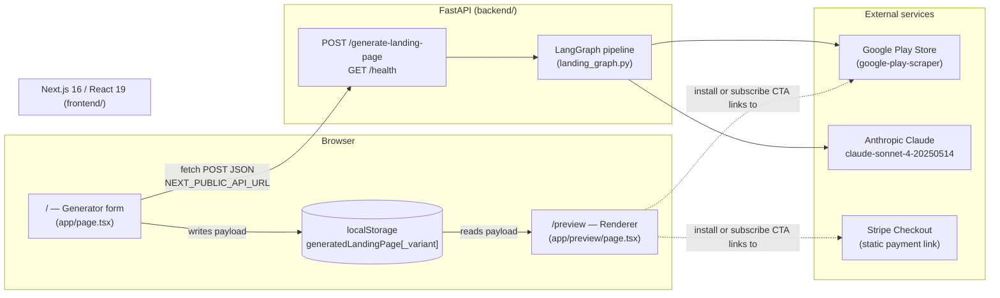
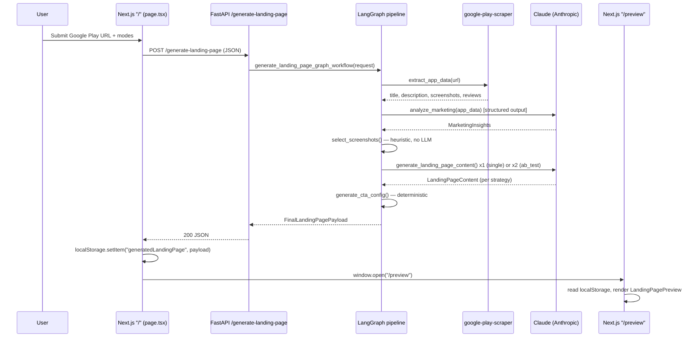
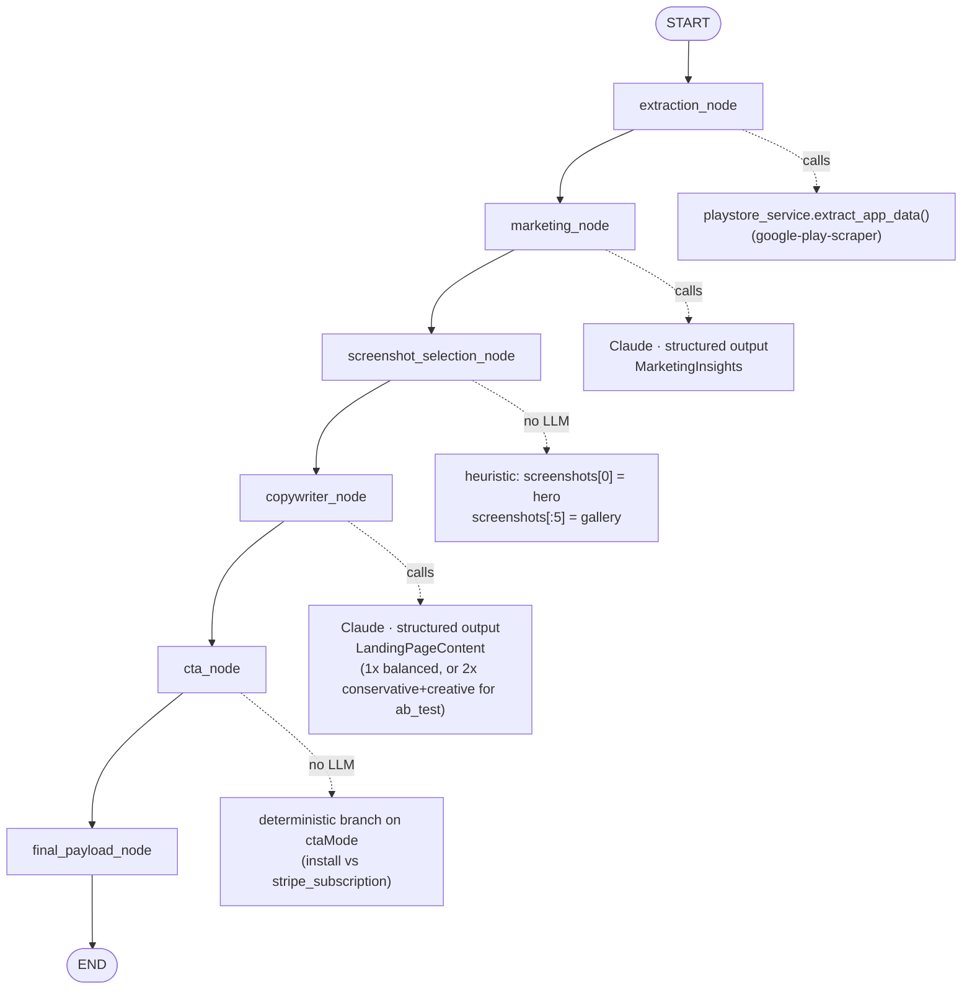
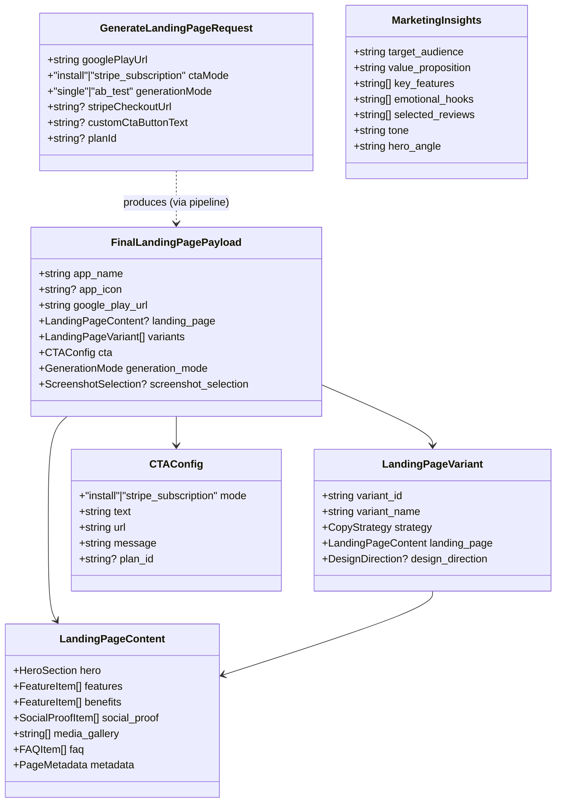

# AI Landing Page Generator — Architecture Deep Dive

> A multi-agent AI system that turns a Google Play Store URL into a complete, conversion-optimized mobile app landing page. This document is a full architectural walkthrough of the codebase as it exists today: stack, routing, data flow, the LangGraph agent pipeline, and known gaps.

---

## 1. Executive Summary

The project is a **two-service monorepo**, not a single deployable app:

- **`backend/`** — a Python **FastAPI** service that runs a **LangGraph** pipeline of five specialized steps ("agents"), three of which call **Claude** (Anthropic) to analyze app data and generate marketing copy. It scrapes app data from the **Google Play Store** (unofficial scraper, no API key) and returns one structured JSON payload.
- **`frontend/`** — a **Next.js 16 / React 19** App Router site with two client-rendered pages: a generator form and a preview renderer. It talks to the backend over plain `fetch`, with no server-side rendering of AI content and no database — the generated payload is handed from the form page to the preview page via `localStorage`.

There is no database, no auth, no background jobs, and no deployment manifest (no Dockerfile/CI). It is best described as a working **prototype / MVP**, not production-hardened infrastructure. That's a deliberate, reasonable trade-off for what the product needs to prove (see §8).

---

## 2. High-Level Architecture



**Why split this way?** The AI pipeline (LangGraph + LangChain + Claude SDKs) is Python-native — that ecosystem is the most mature for agent orchestration. The presentation layer benefits from Next.js's image optimization (`next/image` against Google's CDN), fast iteration, and a familiar React component model. Keeping them as independent HTTP services (rather than e.g. Next.js API routes calling into a shared Python process) means the slow, LLM-bound work is isolated behind one endpoint and the frontend never blocks on anything but that single call.

---

## 3. Tech Stack

### Backend (`backend/`)

| Layer | Technology | Version | Why this choice |
|---|---|---|---|
| Language | Python | 3.11+ (dev on 3.13) | Required for the LangChain/LangGraph ecosystem, which is Python-first; also the natural home for `google-play-scraper`. |
| Web framework | FastAPI | 0.136.1 | Async-friendly, Pydantic-native request/response validation, auto-generated OpenAPI docs at `/docs` with near-zero setup — ideal for a small internal API with one real endpoint. |
| ASGI server | Uvicorn | 0.46.0 | Standard FastAPI pairing. |
| Agent orchestration | LangGraph | 1.2.0 | Models the 5-step pipeline as an explicit typed state graph (`StateGraph`) instead of nested function calls — makes node order, data dependencies, and (future) branching/retries explicit and inspectable. |
| LLM integration | LangChain (`langchain-core`, `langchain-anthropic`) | 1.3.0 / 1.4.0 / 1.4.3 | Provides `with_structured_output()`, which coerces Claude's response directly into a Pydantic model — no manual JSON parsing/repair of LLM output. |
| LLM provider | Anthropic Claude (`claude-sonnet-4-20250514`) | via `langchain-anthropic` 1.4.3, raw `anthropic` 0.101.0 also present | Chosen for strong structured-output / instruction-following on long, rule-heavy marketing prompts. |
| Secondary LLM (defined, unused) | Google Gemini (`gemini-2.5-pro`) via `langchain-google-genai` | 4.2.2 | `get_gemini()` exists in `llm_service.py` as a fallback client but no agent currently calls it — likely scaffolded for future provider redundancy. |
| Validation / schemas | Pydantic | 2.13.4 | Single source of truth for request/response shapes; FastAPI uses the same models for both request validation and OpenAPI generation. |
| App data source | `google-play-scraper` | 1.2.7 | Free, no-API-key access to Play Store listing + review data — appropriate for a prototype that needs title/description/screenshots/reviews without a Play Console partnership. |
| Env config | `python-dotenv` | 1.2.2 | Loads `backend/.env` (`ANTHROPIC_API_KEY`, `GOOGLE_API_KEY`, `STRIPE_CHECKOUT_URL`) at process start. |
| HTTP clients | `httpx`, `requests` | 0.28.1 / 2.34.0 | Transitive deps of the SDKs above. |
| Tests / lint | **none configured** | — | No pytest, no ruff/black config. `backend/test.py` is an ad-hoc manual script, not a suite. |
| Persistence | **none** | — | Fully stateless per request; only optional debug JSON dumps to `backend/outputs/` (gitignored, not on the live path). |

### Frontend (`frontend/`)

| Layer | Technology | Version | Why this choice |
|---|---|---|---|
| Framework | Next.js | 16.2.6 (App Router) | File-based routing for two simple pages, built-in `next/image` optimization against remote CDNs (Play Store icons/screenshots), zero-config TypeScript/ESLint. App Router chosen over Pages Router as the current Next.js default/recommended model. |
| UI library | React | 19.2.4 | Ships with Next 16; no other UI runtime needed for two form/render pages. |
| Language | TypeScript | ^5, strict mode | Mirrors the backend Pydantic models as hand-written TS types (`src/types/landing-page.ts`) for compile-time safety across the fetch boundary. |
| Styling | Tailwind CSS v4 (`@tailwindcss/postcss`) | ^4 | Utility-first styling with no separate design-system dependency — fast for a small, mostly single-developer surface. No component library (no shadcn/MUI) is used. |
| Fonts | `next/font/google` (Geist Sans/Mono) | — | Default `create-next-app` scaffolding, left unchanged. |
| State | React `useState`/`useEffect` only | — | No Redux/Zustand/Context — the app has exactly two pages and one cross-page handoff, which doesn't justify a state library. |
| Cross-page data | `localStorage` | — | The generated payload is large and ephemeral; rather than adding a database or re-fetching, the form page writes it to `localStorage` under `generatedLandingPage` (or `generatedLandingPage_<variantId>` for A/B results) and the `/preview` page reads it back — avoids a second network round trip and a persistence layer for what is essentially "open this in a new tab." |
| Linting | ESLint 9 flat config | — | `eslint-config-next/core-web-vitals` + `/typescript`. |
| Tests | **none** | — | No Jest/Vitest/Playwright config. |
| Auth | **none** | — | Not needed — no user accounts anywhere in the product. |

---

## 4. Project Structure

```
ai-landing-agent/
├── README.md                        High-level pipeline + API overview
├── DEEP_DIVE.md                     This document
│
├── backend/
│   ├── main.py                      FastAPI entrypoint — CORS + router mount
│   ├── requirements.txt             Pinned deps (UTF-16 encoded file, oddity)
│   ├── test.py                      Manual ad-hoc script (not a real test suite)
│   ├── .env                         ANTHROPIC_API_KEY, GOOGLE_API_KEY, STRIPE_CHECKOUT_URL
│   ├── api/
│   │   └── routes.py                GET /health · POST /generate-landing-page
│   ├── agents/
│   │   ├── extraction_agent.py      EMPTY — logic actually lives in services/playstore_service.py
│   │   ├── marketing_agent.py       Claude → MarketingInsights (structured output)
│   │   ├── screenshot_agent.py      Deterministic heuristic (no LLM)
│   │   ├── copywriter_agent.py      Claude → LandingPageContent (3 strategies)
│   │   └── cta_agent.py             Deterministic CTA config (no LLM)
│   ├── workflows/
│   │   ├── landing_graph.py         ACTIVE — LangGraph StateGraph pipeline
│   │   └── landing_workflow.py      LEGACY — pre-LangGraph plain-function version, unused
│   ├── models/
│   │   └── schemas.py               All Pydantic request/response/state models
│   ├── services/
│   │   ├── llm_service.py           get_claude() / get_gemini() client factories
│   │   ├── playstore_service.py     URL validation + Google Play scraping
│   │   └── file_service.py          Debug JSON snapshot writer (outputs/, not on live path)
│   └── outputs/                     Gitignored debug JSON dumps
│
└── frontend/
    ├── next.config.ts                images.remotePatterns for Play Store CDNs
    ├── tsconfig.json                 strict TS, "@/*" path alias
    ├── eslint.config.mjs
    ├── postcss.config.mjs
    ├── .env.local                    NEXT_PUBLIC_API_URL
    ├── app/
    │   ├── layout.tsx                RootLayout, Geist fonts
    │   ├── page.tsx                  "/" — Generator UI (form, progress, results)
    │   ├── globals.css                Tailwind import + light/dark CSS vars
    │   └── preview/
    │       └── page.tsx              "/preview" — reads localStorage, renders result
    └── src/
        ├── components/
        │   └── LandingPagePreview.tsx  Renders hero/features/benefits/proof/gallery/FAQ/CTA
        ├── lib/
        │   └── api.ts                 fetch wrapper → POST /generate-landing-page
        └── types/
            └── landing-page.ts         TS mirror of backend Pydantic schemas
```

---

## 5. Routing

### 5.1 Frontend routes (Next.js App Router, file-based)

| Route | File | Type | Responsibility |
|---|---|---|---|
| `/` | `frontend/app/page.tsx` | Client component (`"use client"`) | Form: Google Play URL, `generationMode` (`single` \| `ab_test`), `ctaMode` (`install` \| `stripe_subscription`). Drives a simulated multi-step progress UI (`CircularProgress`, 5 fake steps ticking every 2.5s), calls `generateLandingPage()`, stores the result in `localStorage`, then opens `/preview` (or `/preview?variant=a`/`b`) in a new tab. |
| `/preview` | `frontend/app/preview/page.tsx` | Client component | Reads the `?variant=` query param, pulls the matching payload out of `localStorage`, renders `<LandingPagePreview>`. |

There is **no `middleware.ts`**, no dynamic segments, no server actions, and no Next.js API routes — every network call from the frontend targets the separate FastAPI service via `NEXT_PUBLIC_API_URL`.

### 5.2 Backend routes (FastAPI, mounted at root in `main.py`)

| Method | Path | Handler | Request | Response | Behavior |
|---|---|---|---|---|---|
| `GET` | `/health` | `routes.health_check` | — | `{"status": "ok"}` | Liveness check. |
| `POST` | `/generate-landing-page` | `routes.generate_landing_page` | `GenerateLandingPageRequest` | `FinalLandingPagePayload` | Runs the full LangGraph pipeline synchronously (single request blocks until all 6 nodes complete). `ValueError` → `400` (bad Play Store URL, missing Stripe URL); any other exception → `500` with a generic message (raw error only `print()`-logged server-side). |

FastAPI auto-generates interactive Swagger docs at `/docs` — no custom documentation tooling needed.

**CORS**: `allow_origins=["*"]`, `allow_credentials=True`, all methods/headers open — a dev-grade, not production-grade, configuration (see §8).

---

## 6. Request Lifecycle (Sequence)



---

## 7. The Agent Pipeline (LangGraph)

`backend/workflows/landing_graph.py` builds an explicit `StateGraph` over a typed `LandingGraphState`. The graph is **linear** today (no branching/loops), but modeling it as a graph rather than a call chain makes it straightforward to add conditional edges, retries, or parallel branches later without restructuring.



### Node-by-node

| Node | Agent file | AI? | Input | Output | Notes |
|---|---|---|---|---|---|
| `extraction` | `services/playstore_service.py` (README calls it "Extraction Agent"; `agents/extraction_agent.py` is actually empty) | No | `googlePlayUrl` | raw app dict (title, description, score, installs, icon, screenshots, up to 20 reviews) | Validates the URL is a `play.google.com` link with an `id` query param before scraping; wraps scraper failures into a friendly `ValueError`. This is the logic added in commit `d216676` ("Add invalid Google Play URL handling"). |
| `marketing` | `agents/marketing_agent.py` | **Yes — Claude** | app data dict | `MarketingInsights` (target audience, value prop, key features, emotional hooks, selected reviews, tone, hero angle) | Prompt explicitly instructs the model to prefer 4–5★ reviews, avoid inventing or summarizing reviews, and select ≥3 real quotes. |
| `screenshot_selection` | `agents/screenshot_agent.py` | No | screenshots list + `MarketingInsights` | `ScreenshotSelection` (hero + up to 5 gallery images, reason string) | Pure heuristic — first screenshot as hero, first 5 as gallery — with a canned rationale. `marketing_insights` is passed in but not actually used by the current logic (room for a smarter, insight-driven selection later). |
| `copywriter` | `agents/copywriter_agent.py` | **Yes — Claude** | app data, marketing insights, cta_mode, selected screenshots, `CopyStrategy` | `LandingPageContent` (hero, features, benefits, social proof, media gallery, FAQ, SEO metadata) | Temperature and prompt rules vary by strategy: `conservative` (temp 0.25, trust-focused, banned hype words), `creative` (temp 0.95, bold/emotional), `balanced` (temp 0.65, default). In `ab_test` mode this node runs **twice** — once per strategy — producing two `LandingPageVariant`s. |
| `cta` | `agents/cta_agent.py` | No | `ctaMode`, Play Store URL, optional Stripe URL/plan/button text | `CTAConfig` | Deterministic branch: `install` → links to Play Store, default text "Download on Google Play"; `stripe_subscription` → requires a Stripe checkout URL (from the request or `STRIPE_CHECKOUT_URL` env fallback), defaults `plan_id` to `"pro_monthly"`. Raises `ValueError` if `stripe_subscription` has no URL anywhere. |
| `final_payload` | `landing_graph.py` (inline) | No | all prior state | `FinalLandingPagePayload` | Assembles the final response object returned to the API caller. |

**Structured output everywhere**: both LLM-calling nodes use LangChain's `.with_structured_output(<PydanticModel>)`, so Claude's response is coerced directly into the typed schema — there is no raw-text/JSON parsing step and no risk of malformed free text reaching the frontend.

### A/B testing (`generationMode: "ab_test"`)

Added in commit `f63300d`. When selected, `copywriter_node` runs twice (conservative + creative), producing two `LandingPageVariant` entries. The frontend renders both as cards with distinct badges and opens each into its own `/preview?variant=a|b` tab, storing them under separate `localStorage` keys so both can be inspected side by side.

---

## 8. Known Gaps / Prototype-Stage Debt

Worth calling out explicitly in a deep dive, since a reviewer will likely ask about these:

| Item | Detail |
|---|---|
| No tests | No pytest/Jest/Playwright anywhere; `backend/test.py` is a manual script, not CI-run. |
| No CI/CD or deploy manifest | No Dockerfile, docker-compose, Vercel config, or GitHub Actions workflow, despite a commit titled "Prepare project for deployment" (it only added an env-var fallback). |
| Wide-open CORS | `allow_origins=["*"]` on the FastAPI app — fine for local dev, not for a public deployment. |
| Hardcoded Stripe test link | `frontend/app/page.tsx` has a literal Stripe **test-mode** payment link constant (not a secret key, but still hardcoded rather than configured). |
| Dead code | `backend/agents/extraction_agent.py` is empty (logic lives in `services/playstore_service.py` instead); `backend/workflows/landing_workflow.py` is a superseded pre-LangGraph implementation no longer imported anywhere. |
| Unused fallback LLM | `get_gemini()` in `llm_service.py` is defined but never invoked by any agent. |
| Unused field | `DesignDirection` schema exists (theme/layout/section style) but no agent currently populates it — likely scaffolding for a future "design agent" step. |
| No persistence | Every generation is fully ephemeral beyond the current browser tab's `localStorage`; nothing is stored server-side unless you manually invoke the debug JSON writer. |

None of this is a criticism of the implementation choices for an MVP — it reflects a project intentionally scoped to prove the multi-agent pipeline concept before investing in productionization.

---

## 9. Data Model Reference

Backend Pydantic models (`backend/models/schemas.py`) are the single source of truth; frontend TypeScript types (`frontend/src/types/landing-page.ts`) are a hand-maintained mirror (no codegen link between them — a place they could drift).



---

## 10. Third-Party Integrations

| Integration | Where | Purpose | Auth |
|---|---|---|---|
| Anthropic Claude | `services/llm_service.get_claude()` | Marketing analysis + copywriting (2 of 5 pipeline nodes) | `ANTHROPIC_API_KEY` |
| Google Gemini | `services/llm_service.get_gemini()` | Defined fallback LLM client — **not currently called** | `GOOGLE_API_KEY` (optional) |
| Google Play Store (unofficial) | `services/playstore_service.py` via `google-play-scraper` | App metadata + review scraping | none (public scrape) |
| Google image CDNs | `frontend/next.config.ts` `images.remotePatterns` | Serving Play Store icons/screenshots through `next/image` | none |
| Stripe | `cta_agent.py` (`STRIPE_CHECKOUT_URL` env fallback) + hardcoded test link in `frontend/app/page.tsx` | Subscription CTA mode — links to a static Stripe Checkout payment link | none (no Stripe SDK used, just a URL) |
| Frontend ↔ Backend | `frontend/src/lib/api.ts` | `NEXT_PUBLIC_API_URL` env var points the client at the FastAPI base URL | none |

---

## 11. Recent Development History

Chronological, oldest → newest:

1. **`2e3080a` Initial commit** — full scaffold: FastAPI backend with agents/workflows/schemas, Next.js frontend with generator + preview pages. `landing_workflow.py` (legacy) and the empty `extraction_agent.py` both present from day one.
2. **`d22bdbc` Prepare project for deployment** — added `STRIPE_CHECKOUT_URL` env fallback and a default `plan_id`; removed a hardcoded example URL from the input field. (No actual Docker/CI/Vercel config added despite the name.)
3. **`d216676` Add invalid Google Play URL handling** — replaced a naive `.split("id=")[-1]` with proper `urlparse`/`parse_qs` validation and try/except wrapping around the scraper call, converting failures into user-facing `ValueError`s.
4. **`5917dc5` styling the home page** — Tailwind-only visual rework of `page.tsx`, no logic changes.
5. **`f63300d` a\b testing without the style** — largest recent change (362/131 lines across 10 files): introduced the entire A/B testing feature (`GenerationMode`, `CopyStrategy`, `LandingPageVariant`, `DesignDirection` schemas; dual copywriter invocation; variant UI + separate preview tabs).
6. **`f23c425` title fix** — small frontend tweak to page/app title display.
7. **`7f8e721` fix** *(HEAD)* — net simplification to `backend/models/schemas.py`.

**Trend**: MVP → deployment hardening → input validation → visual polish → A/B testing feature → small fixes. The project is squarely in active-prototype territory, iterating on the core generation experience before investing in infra.

---

## 12. Talking Points for a Presentation

- **Why LangGraph over a plain function chain?** Explicit typed state + node graph makes the pipeline's data dependencies visible and sets up future branching (e.g., conditional design-direction step, retry-on-failure edges) without a rewrite.
- **Why structured output instead of prompting for JSON?** `with_structured_output()` binds Claude's response directly to the Pydantic schema — eliminates a whole class of "LLM returned malformed JSON" bugs and keeps the API contract enforced by the type system, not by parsing discipline.
- **Why two copywriter passes for A/B testing instead of one prompt asking for two variants?** Separate temperature settings (0.25 vs 0.95) per call give genuinely distinct creative ranges — a single prompt asking for "two versions" tends to produce two variations of the same voice rather than two different strategies.
- **Why no database?** The product's value is in the generation pipeline, not in storing history — every run is a fresh, stateless transformation of one Play Store URL into one payload; `localStorage` is sufficient to hand that payload from the form tab to the preview tab.
- **What would need to change to go to production?** Lock down CORS to a real origin allowlist, add a persistence layer if history/sharing is wanted, replace the hardcoded Stripe test link with configuration, add a test suite and CI, and decide whether the empty `extraction_agent.py` / legacy `landing_workflow.py` should be deleted or filled in.
